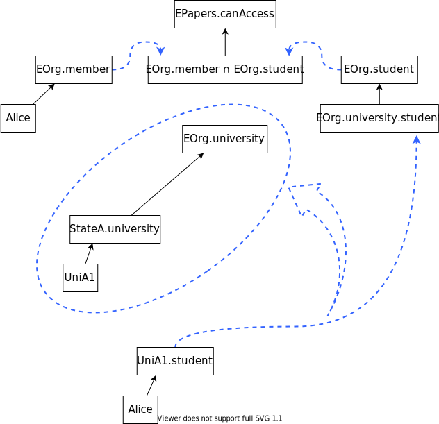
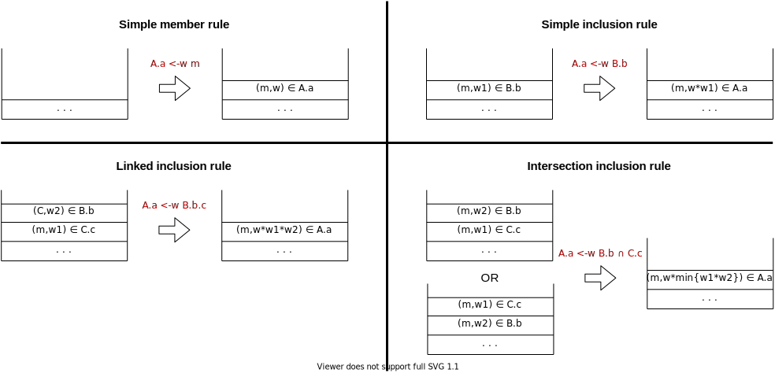

## Osservazioni iniziali

A seguito della implementazione on-chain dell'algoritmo *backward search* per il *credential chain discovery*, abbiamo osservato che il costo necessario alla sua esecuzione risulta eccessivamente elevato, rendendone difficile l'adozione nel contesto di blockchain pubbliche ove siano presenti limitazioni in termini di gas.

Il nuovo obiettivo è stato dunque quello di comprendere meglio le motivazioni e gli interessi alla base di tale implementazione, nonché la ricerca di una soluzione meno costosa.

È stato osservato anzitutto come la necessità di eseguire on-chain le procedure di credential chain discovery abbia origine dall'interesse di rendere verificabili e trasparenti i calcoli in questione, e che ciò occorra principalmente in tutti quei casi e scenari per cui al risultato di elaborazione delle credenziali memorizzate su blockchain conseguano degli obblighi/interessi collettivi piuttosto che individuali. D'altra parte, ricerche i cui esiti interessano e hanno conseguenze unicamente a livello individuale, potrebbero essere eseguite off-chain dall'individuo stesso senza necessariamente ricorrere al consenso distribuito per il calcolo. Siamo a conoscenza di 2 algoritmi per effettuare la procedura di chain discovery:

* la *backward search*, la quale permette di calcolare l'insieme di membri appartenenti ad un certo ruolo
* la *forward search*, la quale permette di calcolare l'insieme di ruoli assegnati ad un certo membro
* l'esecuzione di entrambi gli algoritmi contemporaneamente permette di verificare l'assegnamento di un certo ruolo ad un certo membro

Abbiamo notato come entrambi gli algoritmi assolvano anche a verificare i loro rispettivi obiettivi complementari, ovvero permettano di accertare l'assenza di determinati membri all'interno di determinati ruoli.

In tutti i casi trattati sin ora (backward/forward, on-chain/off-chain), l'alta complessità di esecuzione delle procedure di chain discovery è motivata dalla costruzione del *proof graph*, che prevede l'esplorazione e la valutazione di tutte le credenziali potenzialmente in grado di contribuire alla formazione del risultato finale; per quanto sia vero che alcune di queste credenziali non apporteranno concretamente alcuna soluzione finale nell'insieme risultante, è importante osservare che la loro verifica risulta essenziale al fine di assolvere ai suddetti obiettivi complementari (in altre parole, non è possibile verificare l'effettiva assenza di un membro in un ruolo senza valutare ogni possibile credenziale coinvolta). In definitiva, dal momento in cui siamo interessati ad accertare l'assenza di determinati membri in determinati ruoli, la valutazione di tutte le credenziali tra loro correlate diviene essenziale.


## Una prima idea

Osservando vari possibili scenari, è stato appurato come il ricorso al chain discovery abbia come tipico obiettivo quello di verificare l'assegnamento di uno o più ruoli ad uno o più membri, piuttosto che la verifica del complementare. In tal caso, considerando l'esecuzione on-chain della procedura di chain discovery, non vi sarebbe alcun interesse nel garantire l'auditability nella valutazione di quelle credenziali che sicuramente non concorrerebbero alla costruzione dei risultati effettivi a cui siamo interessati.

Sulla base di tale osservazione, una prima idea per ridurre il costo di esecuzione on-chain consiste nel disporre di:

* una procedura off-chain in grado di individuare i sottoinsiemi minimi di credenziali presenti su blockchain utili a verificare un determinato assegnamento di uno o più ruoli ad uno o più membri
* una procedura on-chain di chain discovery operante su tale sottoinsieme ristretto di credenziali (supponendo che questo venga fornito in modo tale che le credenziali in questione siano effettivamente presenti su blockchain)

Si consideri come esempio la seguente policy:

```
EPapers.canAccess ← EOrg.member ∩ EOrg.student
EOrg.student ← EOrg.university.student

EOrg.university ← StateA.university
EOrg.university ← StateB.university
[...]

StateA.university ← UniA1
StateA.university ← UniA2
StateA.university ← [...]
StateB.university ← UniB1
StateB.university ← UniB2
StateB.university ← [...]
[...]

UniA1.student ← Alice
UniA1.student ← Bob
[...]

UniB1.student ← Charlie
UniB1.student ← David
[...]

EOrg.member ← Alice
[...]
```

Siamo interessati a verificare che al principal *Alice* sia assegnato il ruolo *EPapers.canAccess*. In figura troviamo rappresentato:

* il grafo (a) delle credenziali che costituisce la policy
* il proof graph (b) generato dal backward search algorithm avente come ruolo oggetto della ricerca *EPapers.canAccess*. In blu sono evidenziati gli archi generati dall'algoritmo, detti *derived edges* [ref] e prodotti dalla valutazione di credenziali di inclusione intersecata o linkata. Ovviamente, un proof graph mantiene inoltre all'interno di ciascun nodo un insieme di soluzioni, non mostrate in figura
* evidenziato in rosso (c) la porzione di proof graph che sarebbe stata sufficiente generare per provare ciò a cui siamo interessati


Eseguendo tale procedura di chain discovery off-chain, saremmo dunque in grado di costruire il *sottoinsieme minimale di credenziali* utili ad appurare che ad *Alice* risulti assegnato il ruolo in questione:

```
EPapers.canAccess ← EOrg.member ∩ EOrg.student
EOrg.student ← EOrg.university.student
EOrg.university ← StateA.university
StateA.university ← UniA1
UniA1.student ← Alice
EOrg.member ← Alice
```

Una volta trovato tale sottoinsieme, esso potrebbe essere fornito come input ad una procedura di chain discovery on-chain la quale, operando in modo ristretto sulle sole credenziali del sottoinsieme, presenterebbe un costo di esecuzione minore o uguale rispetto alla sua esecuzione sull'intero insieme delle credenziali: ciò accade in quanto l'espansione del proof graph sarebbe garantita limitarsi alle sole credenziali effettivamente utili all'ottenimento delle soluzioni che siamo interessati a verificare tramite secure computing. Nello specifico, l'algoritmo di chain discovery produrrebbe il seguente proof graph:



dove il derived edge che collega il nodo *UniA1.student* ad *EOrg.university.student* è detto *derived linked edge* [ref] in quanto generato dalla valutazione di una credenziale di inclusione linkata. Essi sono caratterizzati da un *support set* [ref], ovvero un percorso di nodi che ne giustifichi l'esistenza. In figura, la porzione di proof graph cerchiata corrisponde al support set per il derived link edge in questione.

Ricapitolando. Secondo questa prima idea, se siamo interessati a verificare che ad il principal *A* risulti assegnato il ruolo *R* dovremo:

1. eseguire off-chain una procedura di chain discovery mirata a verificare tale obiettivo, sfruttando le credenziali attualmente presenti su blockchain. Se l'esito è positivo, vorremo eseguire on-chain una procedura che garantisca auditability nel fatto che attualmente al principal *A* risulti assegnato il ruolo *R*
2. per far ciò, sempre off-chain, il proof graph prodotto viene esaminato al fine di trovare quel sottoinsieme di credenziali la cui valutazione abbia permesso di verificare l'obiettivo
3. il sottoinsieme di credenziali così trovato viene fornito ad una procedura di chain discovery on-chain, la quale durante i suoi calcoli si limiterà a valutare quelle sole credenziali
4. tale procedura restituirà infine le soluzioni contenute nel nodo rappresentante il ruolo *R*, tra le quali sarà sicuramente presente il principal *A*


## Approccio finale

Si osserva che questa prima idea, per quanto operante su un insieme ristretto di credenziali, manterrebbe dello stesso ordine la complessità della procedura di chain discovery on-chain, in quanto sarebbe comunque prevista la costruzione di un proof graph. Da qui l'idea piuttosto di ricorrere a:

* un algoritmo off-chain che includa:
  * anzitutto, l'esecuzione di un chain discovery esteso a tutte le credenziali attualmente presenti on-chain
  * successivamente, la costruzione di una *dimostrazione* sulla base del sottoinsieme minimo utile di credenziali trovato
* un algoritmo on-chain in grado di verificare tramite secure computing la dimostrazione prodotta off-chain

È chiaro come tale idea assuma rilevanza solo dal momento in cui il processo di verifica on-chain presenti una complessità minore rispetto alla esecuzione on-chain di un algoritmo di credential chain discovery. A questo scopo, saremmo interessati a rielaborare un dato sottoinsieme minimo di credenziali in una certa forma di "dimostrazione" facilmente ed inequivocabilmente verificabile on-chain.

Il metodo che abbiamo implementato e sperimentato prevede:

* come dimostrazione: una particolare permutazione delle credenziali contenute nel sottoinsieme minimale di credenziali calcolato off-chain; tale dimostrazione ha lo scopo di rappresentare la sequenza di credenziali simple member ed inclusion in grado di giustificare la soluzione interessata
* come verifica della dimostrazione: una procedura che processi sequenzialmente tali credenziali ordinate

### Procedura di verifica

La procedura di verifica è definita da 4 regole, ciascuna per ogni tipo di credenziale, e fa utilizzo di una stack di elaborazione, il cui stato viene letto e aggiornato da parte delle regole. La stack di elaborazione mantiene delle soluzioni, vale a dire delle triple composte da *role*, *member* e *weight*, rappresentanti risultati intermedi di elaborazione della dimostrazione.

La procedura ha inizio con stack di elaborazione vuota e procede a valutare ordinatamente le credenziali della dimostrazione; per ciascuna di esse:

1. la credenziale deve risultare esistente 
2. deve essere rispettata ed applicata la regola relativa alla credenziale

Se anche una sola credenziale non risulta esistente o se una regola non è rispettata, la procedura fallisce. Se invece tutte le credenziali della dimostrazione sono state processate con successo applicando tutte le regole, la soluzione che si troverà in cima alla stack di elaborazione costituirà la soluzione dimostrata da parte della dimostrazione fornita.

La seguente figura descrive, per ciascuna delle 4 regole:

* in rosso, il prototipo di credenziale su cui essa è applicata
* alla sinistra delle frecce, il/i possibili stati della stack di elaborazione affinché la regola sia rispettata
* alla destra delle frecce, il nuovo stato della stack di elaborazione dopo l'applicazione della regola (se rispettata). I puntini indicano che la stack può contenere un numero indefinito o zero di altre soluzioni qualsiasi



Si osserva che:

* l'esecuzione di tale procedura di dimostrazione non necessita il ricorso a strutture dati dinamiche complesse
* l'applicazione progressiva delle singole regole sulle soluzioni contenute nella stack di elaborazione, corrisponde alla "esecuzione" delle rispettive credenziali contenute nella dimostrazione. Tornando in termini di proof graph, è come se la procedura eseguisse sequenzialmente le credenziali necessarie a far fluire, tramite gli archi, una soluzione da un nodo di origine ad un nodo destinazione


### Costruzione della dimostrazione

Una volta calcolato off-chain il sottoinsieme minimale di credenziali, questo deve essere permutato in una sequenza che costituisca una dimostrazione. La dimostrazione deve essere tale per cui, se fornita alla procedura di verifica, questa termini in uno stato della stack di elaborazione avente in cima la soluzione a cui siamo interessati.

Sulla base della ultima osservazione della sezione precedente, possiamo affermare che tale sequenza di credenziali è quella che:

* genera una o più soluzioni iniziali
* rielabora tali soluzioni nella soluzione finale, applicando una serie di credenziali di inclusione

Ricordando ancora una volta che ogni arco del proof graph corrisponde ad una credenziale di inclusione semplice o a più credenziali nel caso di un derived edge, la sequenza di credenziali che costituisce una dimostrazione è quella ottenuta ripercorrendo gli archi del proof graph che sono stati attraversati dalla soluzione per giungere al nodo rappresentante il ruolo di interesse. Se costruita in questo modo, la dimostrazione è verificabile applicando le regole utilizzate dall'algoritmo di verifica e descritte nella sezione precedente, terminando con la soluzione a cui siamo interessati.

Tornando all'esempio principale, sappiamo che il seguente è il sottoinsieme minimale di credenziali utili per dimostrare che *Alice* appartenga ad *EPapers.canAccess*:

```
EPapers.canAccess ← EOrg.member ∩ EOrg.student
EOrg.student ← EOrg.university.student
EOrg.university ← StateA.university
StateA.university ← UniA1
UniA1.student ← Alice
EOrg.member ← Alice
```

La permutazione di tali credenziali che costituisce una dimostrazione valida, è quella che:

1. (A) genera la soluzione "*Alice appartiene al ruolo UniA1.student*"
2. dimostra che *UniA1* appartenga ad *EOrg.university* nel seguente modo:
   1. (B) genera la soluzione "*UniA1 appartiene al ruolo StateA.university*"
   2. (C) trasforma la soluzione "*UniA1 appartiene al ruolo StateA.university*" in "*UniA1 appartiene al ruolo EOrg.university*"
3. (D) trasforma le soluzione "*Alice appartiene al ruolo UniA1.student*" e "*UniA1 appartiene al ruolo EOrg.university*" in "*Alice appartiene al ruolo EOrg.student*"
4. (E) genera la soluzione "*Alice appartiene al ruolo EOrg.member*"
5. (F) trasforma le soluzioni "*Alice appartiene al ruolo EOrg.student*" e "*Alice appartiene al ruolo EOrg.member*" in "*Alice appartiene al ruolo EPapers.canAccess*", ovvero la soluzione finale che siamo stati interessati a dimostrare

```
(A) UniA1.student ← Alice
(B) StateA.university ← UniA1
(C) EOrg.university ← StateA.university
(D) EOrg.student ← EOrg.university.student
(E) EOrg.member ← Alice
(F) EPapers.canAccess ← EOrg.member ∩ EOrg.student
```

Costruire tale dimostrazione è immediato applicando una semplice modifica agli algoritmi di chain discovery: si ricorda anzitutto che una soluzione in un nodo del proof graph corrisponde ad una coppia <principal, peso>, e rappresenta il fatto che tale principal risulti membro dell'assigned role rappresentato dal nodo o soluzione della role expression rappresentata dal nod; affinché l'algoritmo generi delle dimostrazioni, tale coppia deve essere modificata in una tripla <principal, peso, percorso> dove percorso rappresenta il path di archi del proof graph attraversati dalla soluzione per giungere al nodo che la possiede. Nel caso in cui un arco attraversato sia un derived edge, il percorso deve includere il support set di tale arco. Un percorso di archi può quindi essere trasformato in una sequenza di credenziali: infatti, se l'arco va dal nodo *A* al nodo *B* dove A e B sono role expressions o assigned roles, la relativa credenziale che rappresenta tale arco sarà `B <- A`.


Ricapitolando. Secondo l'approccio finale, se siamo interessati a verificare che ad il principal *A* risulti assegnato il ruolo *R* dovremo:

1. eseguire off-chain una procedura di chain discovery alterata in modo da tener conto dei percorsi attraversati dalle soluzioni, mirata a verificare l'obiettivo sfruttando le credenziali attualmente presenti su blockchain
2. se l'esito è positivo, ovvero il nodo rappresentante l'assigned role *R* contiene una soluzione di principal *A*, viene ottenuto il percorso contenuto in tale soluzione
3. il percorso viene quindi trasformato in una sequenza di credenziali, che costituirà la dimostrazione del fatto che il principal *A* appartenga al ruolo *R*
4. la dimostrazione completamente costruita off-chain viene infine fornita alla procedura di verifica on-chain la quale (a meno che nel frattempo le credenziali presenti on-chain siano state alterate) terminerà con esito positivo

Notare che:

* l'approccio appena presentato è basato su uno schema di computing ibrido on-chain/off-chain che permette di testimoniare, garantendo auditability, il fatto che un certo membro appartenga ad un certo ruolo. Tuttavia, non è paragonabile al secure computing che si avrebbe eseguendo per intero l'algoritmo di chain discovery on-chain in quanto:
  1. non permette di testimoniare il complementare, ovvero che ad certo principal NON risulti assegnato un certo ruolo
  2. lo schema è vulnerabile ad eventuali attacchi o errori di calcolo sulla macchina locale che costruisce la dimostrazione off-chain
* non è stato specificato cosa avviene esattamente al termine del processo di verifica on-chain. Ciò dipende fortemente dall'utilizzo che vuole esserne fatto di DART. Nella implementazione realizzata, il metodo di verifica on-chain NON riceve come argomento la soluzione che vuole essere verificata, ma solo la dimostrazione. Di conseguenza, esso non è in grado di stabilire se la dimostrazione la cui verifica sia terminata con successo, risulti nella effettiva soluzione che siamo stati interessati verificare. Il metodo dunque, restituisce la soluzione che risulta essere stata dimostrata. Sarà compito di chi (utente/smart contract) riceverà tale risultato stabilire se ciò corrisponde ad un successo o meno del processo di verifica. In alternativa, il metodo potrebbe ricevere in input ANCHE la soluzione che deve essere dimostrata, restituendo un booleano rappresentante la coerenza tra risultato ottenuto e voluto. Inoltre, il metodo potrebbe al termine registrare su blockchain l'esito della verifica associandovi un identificativo, il quale verrà restituito come output del metodo (in questo modo, tale identificativo servirà da testimonianza PERMANENTE che, in un determinato istante, era vero che ad un certo principal appartenesse un certo ruolo)
* esistono senz'altro altri schemi di costruzione di dimostrazione + verifica della dimostrazione. Alcuni vantaggi e svantaggi di quella proposta sono:
  * (+) algoritmo di verifica on-chain semplice e molto lineare
  * (+) fa utilizzo di una sola struttura dinamica stack, la cui dimensione massima necessaria può essere facilmente calcolata off-chain assieme alla dimostrazione stessa. La stack può dunque essere considerata statica, in quanto immediatamente allocata della dimensione necessaria e sufficiente (fornendo come parametro alla procedura la dimensione in questione)
  * (+) in molti scenari di policy come ad esempio le web of trust, difficilmente una dimostrazione risulterà lunga (motivo: limite teorico al numero di gradi di parentela)
  * (-) permette di verificare l'appartenenza di un solo membro ad un solo ruolo (a differenza ad esempio della backward search che restituisce tutti i membri appartenenti ad un dato ruolo)
  * (-) durante la sua esecuzione, a causa dell'utilizzo del modello a stack, la valutazione di credenziali nella dimostrazione fa sì che soluzioni intermedie vengano "scartate" per dar luogo a nuove soluzioni intermedie, ma quelle stesse soluzioni scartate sarebbero potute risultare utili per poter processare un'altra credenziale